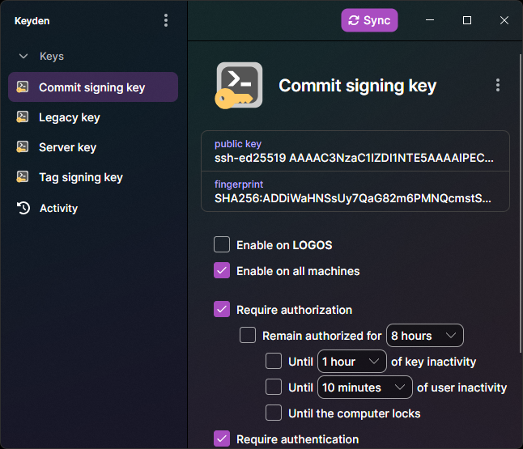

# Keyden



Make sure when you install Git for Windows, you do ***not*** use the bundled OpenSSH, but rather Window's OpenSSH.

> [!NOTE]
> If you installed Git's bundled OpenSSH, and you do not wish to reinstall Git, you may configure Git to use it with
> 
> ```
> git config --global core.sshCommand "C:/Windows/System32/OpenSSH/ssh.exe"
> ```

> [!WARNING]
> Ensure Window's OpenSSH SSH Authentication Agent is not running or enabled in services

Configure the daemon:

For `~/.ssh/configs

```
Host *
	IdentityAgent "//./pipe/openssh-ssh-agent"
```

Then tell Git to use the signing key

```
git config --global gpg.format ssh
git config --global user.signingkey "ssh-ed25519 AAAAC3NzaC1lZDI1NTE5AAAAIPECHV7YlDaqAEcbh+6TKaUE27RrylwlGjR5AwoAkBcW"
git config --global commit.gpgsign true
```

## TODO:

- Add welcome popup showing how to configure Git
- Add ability to automatically configure Git's configure SSH agent
- Add ability to configure Git's signing keys
